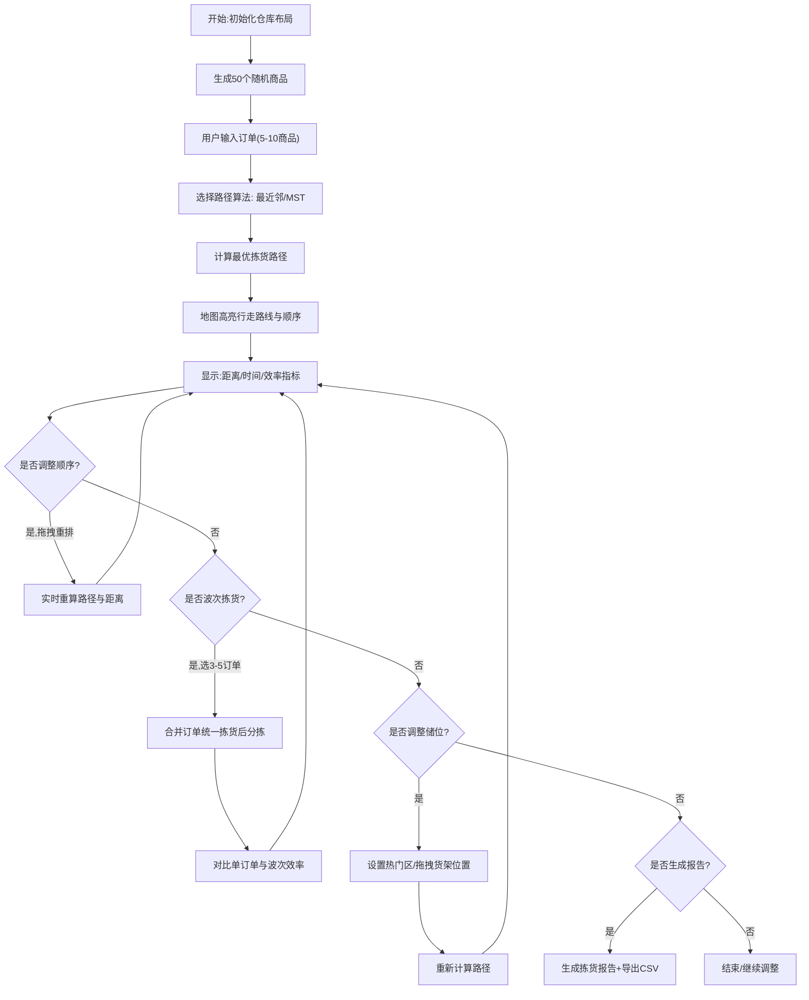

## 1. 产品概述

电商仓库拣货路径优化模拟器是一个基于Web的交互式工具，帮助仓储管理人员可视化、优化和评估拣货作业流程。通过算法优化、动态模拟和数据报表，降低拣货行走距离，提升仓储运营效率。

- 目标用户：仓储运营经理、仓库布局规划师、物流工程专业学生
- 核心价值：直观展示路径优化效果，量化效率提升，辅助储位和波次策略决策

## 2. 核心功能

### 2.1 用户角色
| 角色 | 注册方式 | 核心权限 |
|------|----------|----------|
| 普通用户 | 无需注册，直接使用 | 所有功能完整访问，数据本地存储 |

### 2.2 功能模块
1. **仓库布局可视化**：10×10网格货架地图、商品随机分布、区域划分与热门标记
2. **订单与路径管理**：订单输入、商品坐标选择、最优路径算法（最近邻/最小生成树）、路径高亮
3. **手动顺序调整**：拖拽式拣货顺序重排、实时距离更新
4. **波次拣货模拟**：多订单合并（Wave Picking）、效率提升对比评估
5. **动态储位优化**：货架位置拖拽调整、基于热门度的智能重排
6. **数据报表中心**：拣货报告（距离/时间/明细）、拣货效率指标、CSV路径导出

### 2.3 页面详情
| 页面名称 | 模块名称 | 功能描述 |
|----------|----------|----------|
| 主控制台 | 仓库网格地图 | 10×10货架可视化，商品/通道/起点标注，路径连线与步骤序号 |
| 主控制台 | 订单输入面板 | 订单选择器、商品列表、坐标输入、添加/删除商品 |
| 主控制台 | 路径算法切换 | 最近邻法 / 最小生成树算法选择，算法说明提示 |
| 主控制台 | 顺序拖拽列表 | 可排序拣货步骤列表，拖拽手柄，实时距离刷新 |
| 主控制台 | 波次拣货区域 | 多订单选择、合并拣货、单订单vs波次效率对比柱状图 |
| 主控制台 | 储位管理面板 | 热门区域设置、货架拖拽、一键优化储位按钮 |
| 主控制台 | 指标卡片区 | 总距离、预计时间、每小时件数、回退距离节省率 |
| 主控制台 | 报告与导出区 | 拣货明细表格、生成报告、CSV坐标导出 |

## 3. 核心流程

## 4. 用户界面设计

### 4.1 设计风格

- **主色调**：深邃工业蓝 `#1e3a5f`（仓库稳重感）搭配活力橙 `#ff6b35`（拣货动作强调）
- **辅助色**：货位绿 `#2d6a4f`、路径青 `#00b4d8`、预警红 `#e63946`
- **背景系统**：深蓝渐变 + 微妙网格纹理，营造工业科技氛围
- **按钮风格**：微立体圆角（8px），悬停上浮+发光阴影，按下内凹反馈
- **字体方案**：标题使用 `JetBrains Mono`（等宽 monospace，数据感），正文使用 `Noto Sans SC`（现代中文）
- **图标系统**：使用 Font Awesome 图标，统一线性风格 + 2px 描边
- **布局风格**：三栏卡片式布局（左面板 + 中央地图 + 右指标），细边框 + 毛玻璃背景卡片

### 4.2 页面设计概览
| 页面名称 | 模块名称 | UI元素 |
|----------|----------|--------|
| 主控制台 | 仓库网格地图 | SVG矢量网格，货架单元格渐变色，路径贝塞尔曲线动画，序号气泡标记 |
| 主控制台 | 订单面板 | 折叠卡片，商品标签，坐标选择下拉框，添加/删除动画 |
| 主控制台 | 拖拽列表 | Sortable.js 拖动手柄，拖动时半透明+绿色指示线 |
| 主控制台 | 波次对比 | Chart.js 迷你柱状图，前后对比数字翻牌动画 |
| 主控制台 | 指标卡片区 | 大号数据字体，背景发光晕，趋势小箭头（↑↓） |
| 主控制台 | 报告区 | 斑马纹表格，高亮最大值行，打印样式 |

### 4.3 响应式

- 桌面优先（≥1440px）：三栏完整布局，中央地图≥700×700px
- 平板（768–1439px）：左右面板折叠为抽屉式抽屉，地图自适应居中
- 移动（<768px）：纵向堆叠布局，地图优先展示，面板通过底部Tab切换

### 4.4 动效细节
- 地图路径绘制：SVG stroke-dashoffset 逐步描绘动画（0.8s）
- 指标更新：数字滚动动效（requestAnimationFrame）
- 卡片悬停：translateY(-2px) + 阴影加深（0.2s cubic-bezier）
- 拖拽反馈：被拖元素缩小+半透明，目标位置插入绿色光条
- 波次完成：效率提升数字脉冲放大3次庆祝效果
