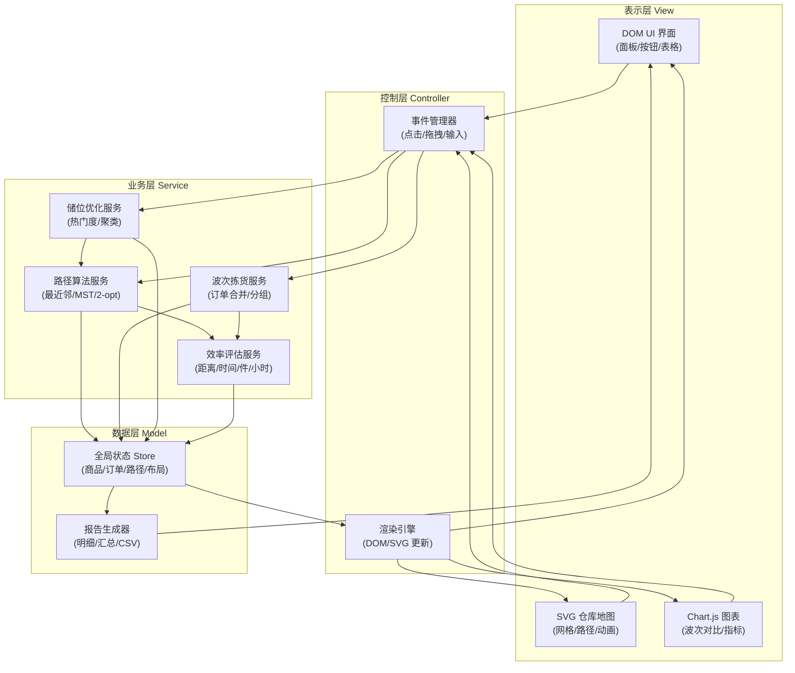

## 1. 架构设计



## 2. 技术说明

- **前端技术**：原生 HTML5 + CSS3 + 原生 JavaScript (ES6+)，无框架依赖，零构建步骤
- **地图渲染**：SVG 矢量绘图（内联 `<svg>`，通过 JS 动态生成 `<rect>`/`<line>`/`<text>`/`<path>`）
- **图表库**：Chart.js 4.4.0（CDN 引入，用于波次对比柱状图）
- **拖拽库**：SortableJS 1.15.0（CDN 引入，用于拣货顺序和货架位置重排）
- **CSS 系统**：CSS Variables + Flexbox + Grid 布局，毛玻璃 backdrop-filter
- **动画方案**：CSS keyframes + SVG stroke-dashoffset + requestAnimationFrame 数字滚动
- **数据持久化**：localStorage（可选保存当前布局和订单）
- **CDN 资源**：
  - Chart.js：`https://cdn.jsdelivr.net/npm/chart.js@4.4.0/dist/chart.umd.min.js`
  - SortableJS：`https://cdn.jsdelivr.net/npm/sortablejs@1.15.0/Sortable.min.js`
  - Font Awesome：`https://cdn.jsdelivr.net/npm/@fortawesome/fontawesome-free@6.4.0/css/all.min.css`
  - Google Fonts：JetBrains Mono + Noto Sans SC

## 3. 文件结构

| 文件路径 | 职责说明 |
|----------|----------|
| `index.html` | 单页入口，布局结构 + CDN 引入 |
| `css/style.css` | 全局样式、主题变量、组件样式、动画 |
| `js/store.js` | 全局状态管理（商品、订单、路径、布局） |
| `js/algorithms.js` | 路径算法：最近邻 NN、最小生成树 MST、2-opt 优化 |
| `js/wave.js` | 波次拣货：订单合并、分组策略、效率对比计算 |
| `js/slotting.js` | 储位优化：热门区域、位置重排、智能推荐 |
| `js/renderer.js` | SVG 地图渲染、路径动画、DOM UI 同步更新 |
| `js/efficiency.js` | 效率评估：距离→时间、件/小时、节省率换算 |
| `js/report.js` | 报告生成、明细表格、CSV 导出功能 |
| `js/main.js` | 入口初始化：事件绑定、流程编排、初始数据生成 |

## 4. 数据模型

### 4.1 核心数据结构

```javascript
// 商品定义
Product {
  id: string,          // 唯一ID "P001"-"P050"
  name: string,        // 商品名称 "商品A" / 真实SKU名
  sku: string,         // SKU编码
  x: number,           // 货架X坐标 0-9
  y: number,           // 货架Y坐标 0-9
  hotLevel: number,    // 热门度 1-5 (5=最热门)
  zone: string,        // 所属区域 "A"/"B"/"C" (按热门度分)
  pickTime: number     // 单件拣货耗时(秒), 默认5s
}

// 订单
Order {
  id: string,          // "O001"
  items: string[]      // 商品ID数组, 5-10个
}

// 拣货步骤
PickStep {
  stepIndex: number,   // 步骤序号 1..n
  productId: string,
  from: {x,y},         // 上一位置
  to: {x,y},           // 当前位置
  distance: number,    // 本段曼哈顿距离
  travelTime: number,  // 本段行走时间(秒)
  pickTime: number     // 本段拣货时间(秒)
}

// 路径结果
PathResult {
  algorithm: 'NN'|'MST',
  steps: PickStep[],
  totalDistance: number,   // 总行走距离(米, 每格=1米)
  totalTravelTime: number, // 总行走时间(秒)
  totalPickTime: number,   // 总拣货时间(秒)
  throughput: number       // 每小时拣货件数
}

// 波次结果
WaveResult {
  waveId: string,
  orderIds: string[],
  mergedPath: PathResult,
  separatePaths: PathResult[],
  distanceSaved: number,   // 节省距离百分比
  efficiencyGain: number   // 效率提升百分比
}
```

### 4.2 坐标与距离约定
- 仓库：10×10 网格，坐标 (0,0) 左上角 → (9,9) 右下角
- 拣货起点：(0,0) 位置（仓库出入口）
- 距离算法：曼哈顿距离 `|x1-x2| + |y1-y2|`（模拟通道行走）
- 每格距离：1 米
- 步行速度：1 m/s（3.6 km/h，仓库实际拣货速度）
- 单件拣货操作时间：5 秒（取货+扫码+放入拣货车）

## 5. 算法设计

### 5.1 最近邻算法 (Nearest Neighbor)
```
从起点(0,0)开始
循环:
  找当前位置到所有未访问商品的最小距离点
  移动到该点并加入路径
  标记为已访问
所有商品访问后 → 返回起点
```

### 5.2 最小生成树 + DFS 近似 (MST-based TSP)
```
1. 构建完全图: 所有商品+起点两两之间曼哈顿距离
2. Prim算法生成最小生成树 MST
3. 从起点开始DFS前序遍历MST → 得到访问顺序
4. 去除重复访问 → 得到TSP近似解
5. 返回起点闭合路径
```

### 5.3 2-opt 局部优化（可选增强）
对 NN/MST 的结果执行 2-opt 交换，若交换两节点顺序后总距离更小则接受，迭代至无法改进。

### 5.4 波次拣货策略
- 合并 3-5 个订单的所有商品，去重后统一计算一条最优路径
- 效率对比 = Σ(单订单路径距离) / 波次合并路径距离
